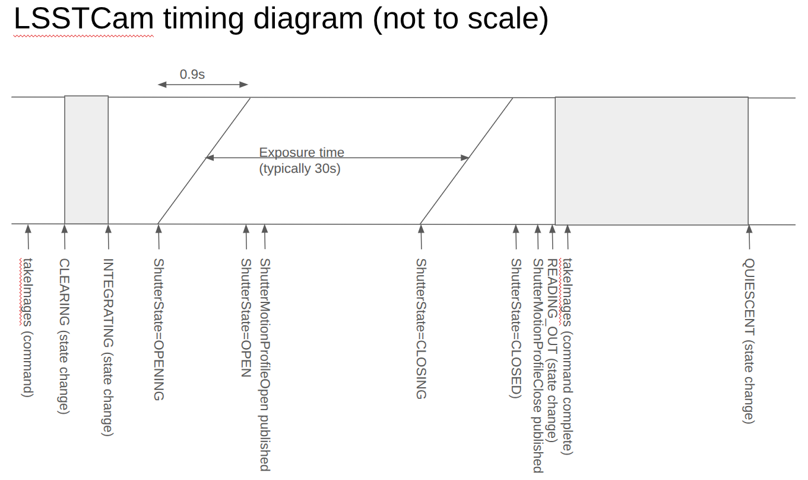

##################################
Shutter Timing and Motion Profiles
##################################

.. abstract::

   A description of how the shutter timing and motion profiles are calculated, along with the corresponding events that are recording in the raw data FITS headers.

Shutter Hardware
================

Shutter Timing Diagram
======================

Shutter Related FITS headers
============================

* SHUTTIME
* EXPOSE
* DARKTIME

Shutter Motion Profile
======================

Related Documents
=================

*

See the `Documenteer documentation <https://documenteer.lsst.io/technotes/index.html>`_ for tips on how to write and configure your new technote.
